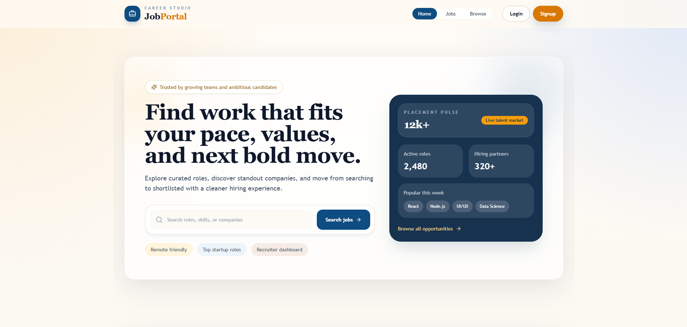
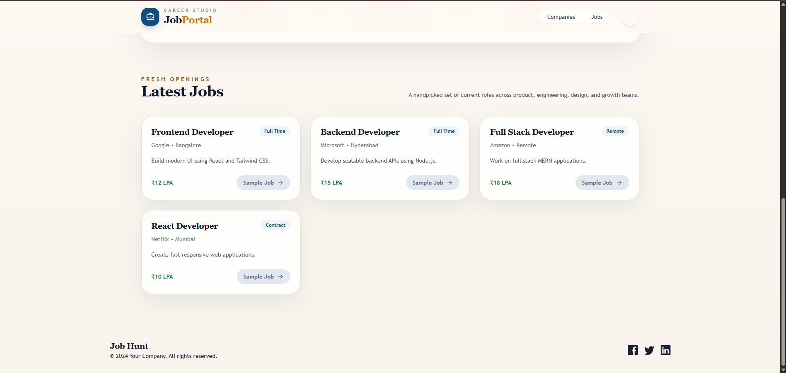
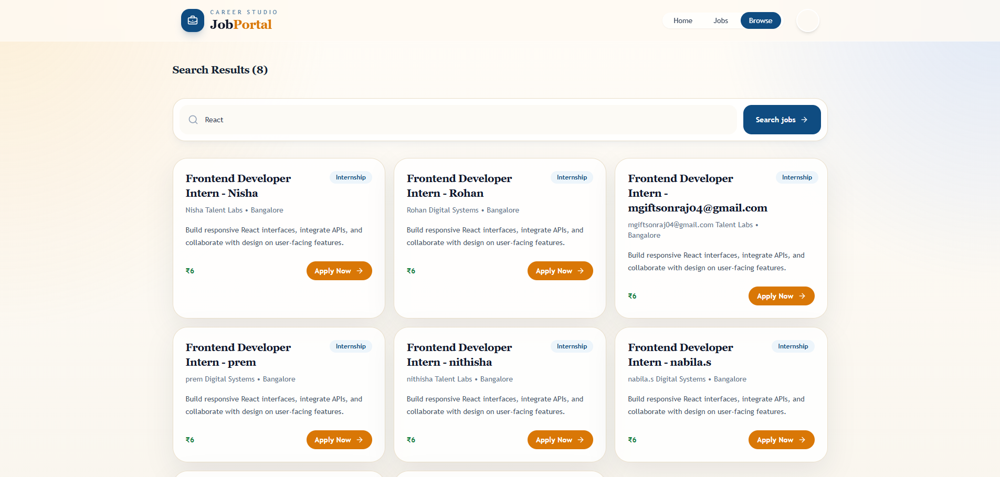
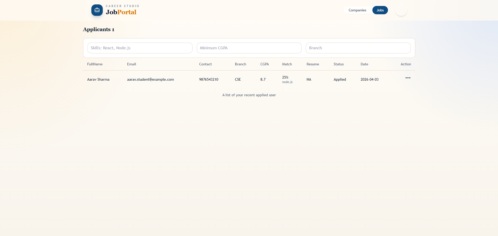
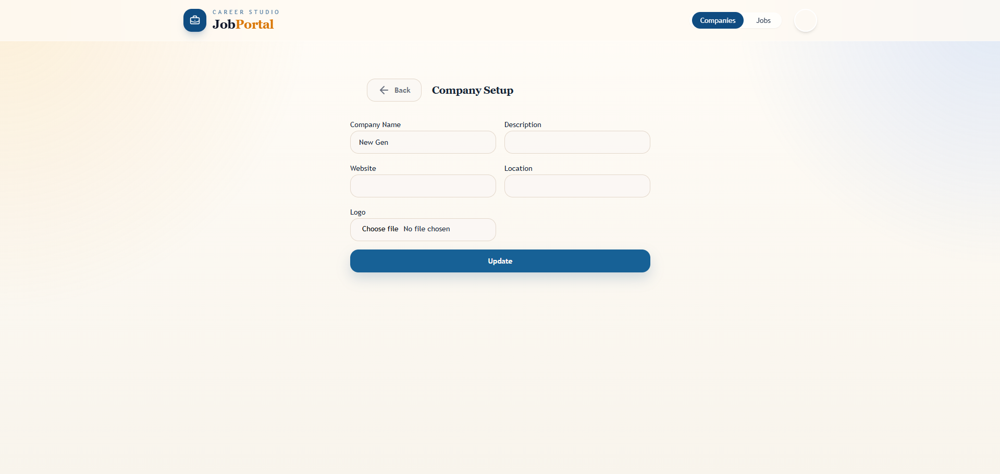

# Job Portal

A full-stack MERN job portal for students and recruiters. Students can browse jobs, apply, and track their application status. Recruiters can create companies, post jobs, review applicants, and shortlist candidates.

## Highlights

- Student and recruiter authentication
- Recruiter company management
- Job posting and job browsing
- Application tracking with `applied`, `shortlisted`, and `rejected` states
- Skill-based shortlisting with match percentage
- Applicant filtering by skills, CGPA, and branch
- Resume upload support

## Images

Add your project screenshots to a folder such as `docs/images/` and reference them here.

### Home Page



### Student Dashboard





### Recruiter Dashboard



### Applicants Page



## Tech Stack

### Frontend

- React
- Vite
- Redux Toolkit
- React Router
- Axios
- Tailwind CSS
- Radix UI

### Backend

- Node.js
- Express
- MongoDB
- Mongoose
- JWT
- Cookie-based auth
- Multer
- Cloudinary

## Project Structure

```text
jobportal/
├─ backend/
│  ├─ controllers/
│  ├─ middlewares/
│  ├─ models/
│  ├─ routes/
│  ├─ scripts/
│  ├─ utils/
│  ├─ index.js
│  └─ package.json
├─ frontend/
│  ├─ public/
│  ├─ src/
│  │  ├─ components/
│  │  ├─ hooks/
│  │  ├─ redux/
│  │  ├─ utils/
│  │  ├─ App.jsx
│  │  └─ main.jsx
│  └─ package.json
└─ README.md
```

## Features

### Student Side

- Sign up and log in
- Browse jobs
- View job details
- Apply to jobs
- View applied jobs and status
- Update profile with skills, branch, CGPA, and resume

### Recruiter Side

- Sign up and log in as recruiter
- Create and update company profiles
- Post jobs
- View jobs created by the logged-in recruiter
- View applicants for each job
- Filter applicants by skills, branch, and CGPA
- Update applicant status

## Environment Variables

Create `backend/.env`:

```env
MONGO_URI=your_mongodb_connection_string
PORT=8000
JWT_SECRET=your_secret_key

# Optional for uploads
CLOUD_NAME=your_cloudinary_name
API_KEY=your_cloudinary_api_key
API_SECRET=your_cloudinary_api_secret
```

Notes:

- `JWT_SECRET_KEY`, `JWT_SECRET`, and `SECRET_KEY` are all supported by the backend.
- The frontend currently uses hardcoded API constants pointing to `http://localhost:8000`.

## Installation

### 1. Clone the repository

```bash
git clone https://github.com/Priyanshi-678/jobportal.git
cd jobportal
```

### 2. Install backend dependencies

```bash
cd backend
npm install
```

### 3. Install frontend dependencies

```bash
cd ../frontend
npm install
```

## Run Locally

### Backend

```bash
cd backend
npm run dev
```

Backend runs on:

```text
http://localhost:8000
```

### Frontend

```bash
cd frontend
npm run dev
```

Frontend usually runs on:

```text
http://localhost:5173
```

Vite may use `5174` or `5175` if the earlier ports are occupied.

## Important Auth Note

Protected recruiter and student routes rely on a login cookie from the backend. If login succeeds but protected requests return `401`:

1. Restart the backend
2. Clear site data for `http://localhost:8000` and your Vite frontend origin
3. Log in again

## Seed / Utility Scripts

Inside `backend/scripts/`:

- `seedData.js`
  Creates linked sample users, companies, jobs, and applications.

- `assignCompaniesAndJobsToRecruiters.js`
  Ensures every recruiter has a company and jobs.

Run a script like this:

```bash
cd backend
node scripts/seedData.js
```

If you use MongoDB Atlas, make sure your IP is allowed in Atlas Network Access before running seed scripts.

## Main API Routes

### Auth

```text
POST /api/auth/register
POST /api/auth/login
```

### User

```text
POST /api/v1/user/register
POST /api/v1/user/login
GET  /api/v1/user/logout
PUT  /api/v1/user/profile
POST /api/v1/user/profile/update
```

### Company

```text
POST /api/v1/company/register
GET  /api/v1/company/get
GET  /api/v1/company/get/:id
PUT  /api/v1/company/update/:id
```

### Job

```text
POST /api/v1/job/post
GET  /api/v1/job/get
GET  /api/v1/job/get/:id
GET  /api/v1/job/getadminjobs
```

### Application

```text
GET  /api/v1/application/apply/:id
GET  /api/v1/application/get
GET  /api/v1/application/:id/applicants
POST /api/v1/application/status/:id/update
```

## Current Behavior Notes

- `/jobs` can show fallback sample cards if backend jobs are empty.
- Recruiter admin pages only show records owned by the logged-in recruiter.
- Applicant shortlisting uses job requirements matched against student profile skills.

## Suggested Demo Accounts

If you have seeded the database, these sample credentials may exist:

```text
Recruiters:
rohan.recruiter@example.com / Recruiter@123
nisha.recruiter@example.com / Recruiter@123

Students:
aarav.student@example.com / Student@123
meera.student@example.com / Student@123
```

## Troubleshooting

### Backend is not running

Make sure:

- MongoDB is reachable
- `backend/.env` exists
- Port `8000` is not occupied by another process

### Atlas connection fails

If you use MongoDB Atlas and seed scripts fail:

- add your current IP in Atlas Network Access
- retry the script

### Recruiter sees no companies or jobs

Recruiter pages only show records where `created_by` matches the logged-in recruiter. Seed or create company/job records for that recruiter first.

## Future Improvements

- Better search and filters on public job browsing
- Real dashboard analytics for recruiters
- Email notifications
- Pagination on large job/applicant lists
- Better test coverage

## Author

Priyanshi Dwivedi

## License

This project is for educational and portfolio use.
